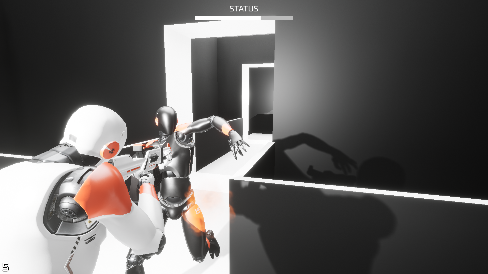

# Necro

## About

Necro is a single-player survival horror demonstration developed in [Unreal Engine](https://www.unrealengine.com) with a mixture of [Blueprints Visual Scripting](https://docs.unrealengine.com/4.27/en-US/ProgrammingAndScripting/Blueprints/) and [C++](https://docs.unrealengine.com/4.27/en-US/ProgrammingAndScripting/ProgrammingWithCPP/). It was originally built in [4.22](https://www.unrealengine.com/en-US/release-notes/unreal-engine-4-22-released) but has been updated to [4.27](https://www.unrealengine.com/en-US/release-notes/unreal-engine-4-27-released) in preparation for a new project. It may be migrated to [5](https://www.unrealengine.com/en-US/unreal-engine-5) once it is stable, only if there is a sufficient learning-based reason to do so.

**Note**: this project requires [Git LFS](https://git-lfs.github.com) (Large File Storage); if the repository is over its data quota, please make a request.

## Builds

Pre-compiled builds are available via [Google Drive](https://drive.google.com/drive/folders/1vRI9i5o5dyCwL4m2Ysaa209SYg2_y5Ot?usp=sharing).

## Screenshots

